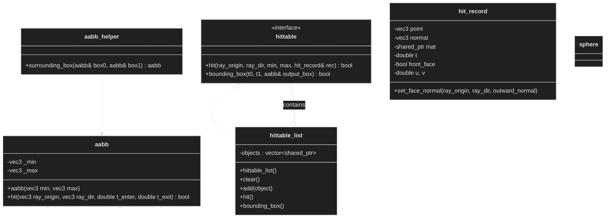
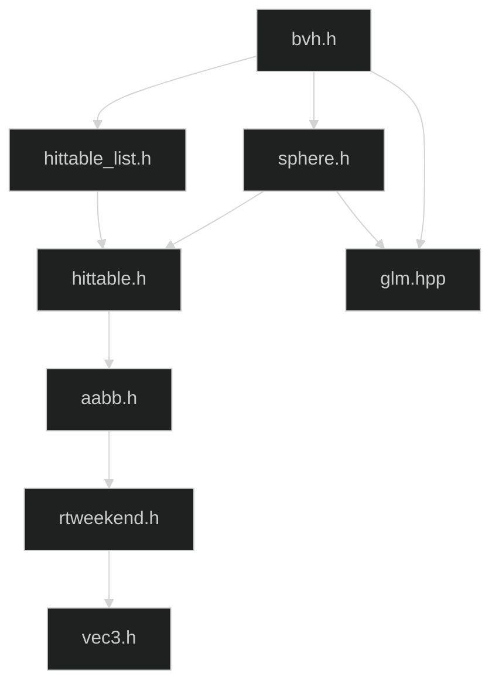

# 类关系图

```mermaid
%%{init: {'theme':'dark'}}%%
classDiagram
    class aabb {
        -vec3 _min
        -vec3 _max
        
        +aabb(vec3 min, vec3 max)
        +hit(vec3 ray_origin, vec3 ray_dir, double t_enter, double t_exit) bool
    }

    class aabb_helper {
        +surrounding_box(aabb& box0, aabb& box1) aabb
    }

    aabb_helper ..> aabb

    class hittable {
        <<interface>>

        +hit(ray_origin, ray_dir, min, max, hit_record& rec) bool
        +bounding_box(t0, t1, aabb& output_box) bool
    }

    class hit_record {
        -vec3 point
        -vec3 normal
        -shared_ptr<material> mat
        -double t
        -bool front_face
        -double u, v

        +set_face_normal(ray_origin, ray_dir, outward_normal)
    }

    class hittable_list {
        -objects : vector~shared_ptr<hittable>~

        +hittable_list()
        +clear()
        +add(object)
        +hit()
        +bounding_box()
    }

    hittable <|.. hittable_list
    hittable_list o-- hittable : contains

    class sphere {
        
    }

```

```mermaid
%%{init: {'theme':'dark'}}%%
flowchart TD

rtweekend.h --> vec3.h
aabb.h --> rtweekend.h
hittable.h --> aabb.h
hittable_list.h --> hittable.h


bvh.h --> hittable_list.h
bvh.h --> sphere.h
bvh.h --> glm.hpp

sphere.h --> hittable.h
sphere.h --> glm.hpp

```